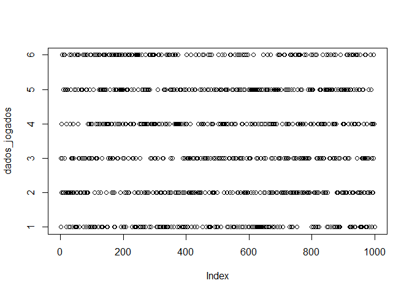
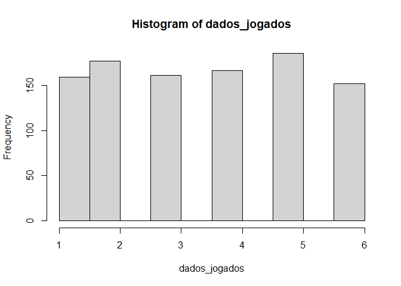

Curso RadarGeo
================

``` r
dados_seq <- seq(from = 1, to = 9)


set.seed(10)
dados_jogados <- sample(x = 1:6, size = 1000, replace = TRUE)
plot(dados_jogados)
```

<!-- -->

``` r
hist(dados_jogados)
```

<!-- -->
